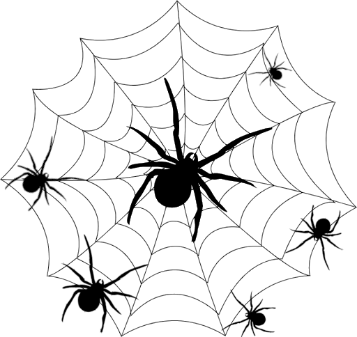

# UseInf_AR
Augmented Reality game made for the course of Advanced User Interface at Master MSE HES-SO Switzerland.

To play the game you will need to print the house image:

 

And at least one of the following spider webs:

 

To start the game, you will have to scan the house and one or two spider webs. 
The objective is to survive the maximum number of waves by killing the spiders before they reach the house by shooting fireballs at them.

Here is a video of the gameplay :

